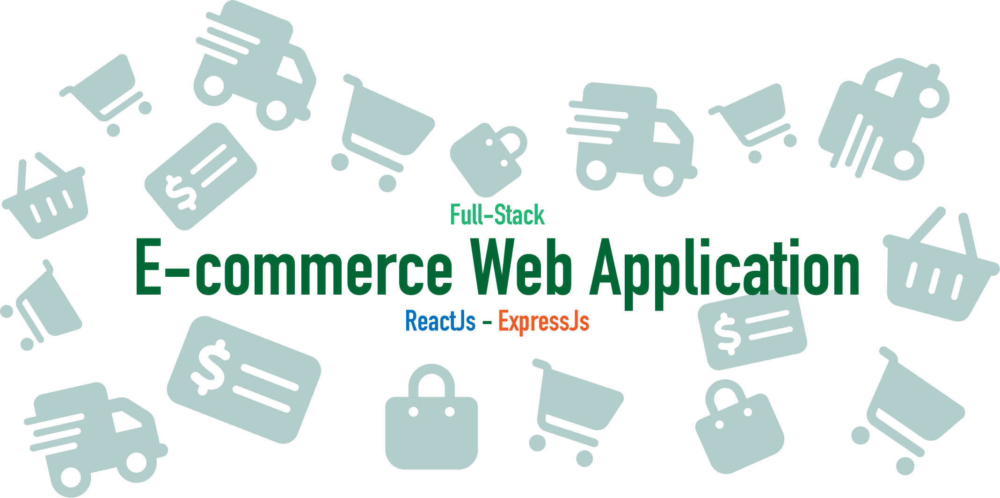
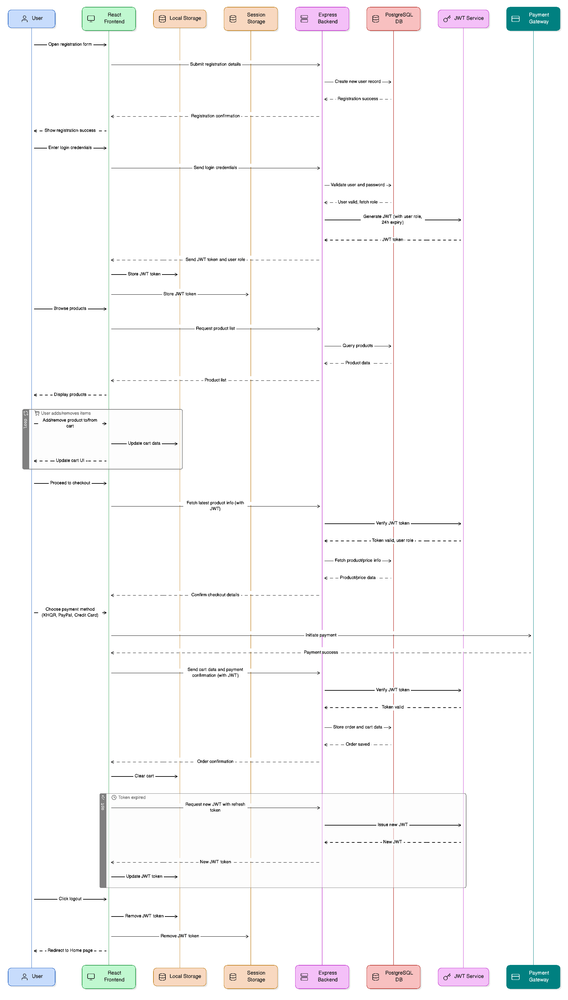

# Full-Stack E-commerce Web Application

This repository contains the complete source code for a full-stack e-commerce web application. The system is developed using **React** (with **Vite** for build optimization) on the frontend and **Node.js** with **Express.js** on the backend. Data persistence is managed using a **PostgreSQL** relational database integrated via **Sequelize ORM**. The application supports typical e-commerce functionalities, including product catalog browsing, shopping cart management, order processing, and user authentication with role-based access control.

All core frontend and backend application logic is included in this repository. The associated database schema and SQL logic are maintained in a separate repository, which is detailed below.

---

## Table of Contents

1. [Project Features](#1-project-features)
   - [1.1. Frontend Capabilities](#11-frontend-capabilities)
   - [1.2. Backend Functionality](#12-backend-functionality)
   - [1.3. Database Design](#13-database-design)
   - [1.4. Sequence Diagram](#13-sequence-diagram)
2. [Technology Stack](#2-technology-stack)
3. [Repository Structure](#3-repository-structure)
4. [Prerequisites](#4-prerequisites)
5. [Getting Started](#5-getting-started)
   - [5.1. Cloning the Project](#51-cloning-the-project)
   - [5.2. Database Setup](#52-database-setup)
   - [5.3. Backend Setup](#53-backend-setup)
   - [5.4. Frontend Setup](#54-frontend-setup)
6. [API Structure](#6-api-structure)
7. [Planned Enhancements](#7-planned-enhancements)
8. [Contributing](#8-contributing)
9. [License](#9-license)

---

## 1. Project Features

This project is a comprehensive full-stack e-commerce web application developed using **React** for the frontend, **Express.js** (Node.js) for the backend, and **PostgreSQL** as the relational database. It offers a seamless shopping experience for customers and includes dedicated interfaces and tools for **sellers** and **administrators**.

Key features include:

- Role-based access control (customer, seller, admin)
- Secure authentication and session management
- Dynamic product filtering and searching
- Cart and checkout functionality
- Seller onboarding and product management
- Admin dashboard for moderation and analytics
- RESTful API design with modular architecture

### 1.1. Frontend Capabilities

- Partially responsive and mobile-optimized user interface for broad device compatibility.
- Product listing with dynamic filtering options by category, price, and additional attributes for enhanced user navigation.
- Detailed product pages showcasing metadata and product variations.
- Shopping cart functionality supporting addition, removal, and quantity adjustment of items.
- Streamlined checkout process with comprehensive form validation for order accuracy.
- Modal-based authentication system enabling secure login and registration workflows.
- Centralized state management via React Context API for consistent data handling across components.
- Dedicated user interfaces for Sellers, enabling product management and order tracking.
- Administrative dashboard for Admins to monitor sales, manage users, and oversee platform operations.

### 1.2 Backend Functionality

- RESTful API architecture with clearly separated concerns via controllers and repositories.
- Secure JWT-based authentication and authorization.
- Role-based access control supporting Customer, Seller, and Administrator roles.
- Comprehensive CRUD operations for managing products, pricing, categories, variations, and media.
- Order placement and tracking logic.
- Scalable and modular Express server structure with robust error handling.

### 1.3. Database Design

- **Normalized Relational Schema**: The database is designed following normalization principles to eliminate redundancy, maintain data integrity, and improve scalability across all e-commerce entities.
- **Stored Procedures**: Efficient multi-table insert and update operations are implemented using PostgreSQL stored procedures, ensuring atomicity and consistency in complex transactions.
- **Views**: Predefined views are created to simplify and optimize analytical queries, enabling efficient reporting and data retrieval without exposing underlying table complexity.
- **Triggers and Constraints**: Business rules and referential integrity are enforced through PostgreSQL triggers and constraints (such as foreign keys, unique constraints, and check constraints), guaranteeing data validity and automated side-effect management.
- **Indexes and Performance Optimization**: Critical columns, including primary keys and foreign keys, are indexed to accelerate query performance. Additional indexes are created on frequently queried fields.
- **Clustering**: Selected tables utilize clustering on indexes to physically order data for faster sequential access, improving performance on large datasets and common query patterns.
- **Maintenance**: Routine maintenance such as vacuuming and analyzing ensure the database remains performant and scalable as data volume grows.

### 1.4. Sequence Diagram

Below is a sequence diagram illustrating the core functionality of the user authentication and checkout process:

This diagram outlines the following key operations:

- User registration and login using JWT authentication
- Product browsing and cart updates
- Checkout with payment gateway integration
- Token refresh and logout flow



---

## 2. Technology Stack

| Layer             | Technologies Used                                         |
| ----------------- | --------------------------------------------------------- |
| Frontend          | React, Vite, React Router, Context API, Vanilla CSS, LDRS |
| Backend           | Node.js, Express.js, Sequelize ORM                        |
| Database          | PostgreSQL                                                |
| Authentication    | JSON Web Tokens (JWT), bcrypt                             |
| Development Tools | ESLint, Prettier, Git, Postman, pgAdmin, nodemon          |

---

## 3. Repository Structure

```
Ecommerce-Website/
├── backEnd/                        # Node.js/Express backend
│   ├── config/                     # Environment and database configurations
│   ├── controllers/                # Business logic for API routes
│   ├── middlewares/                # Authentication, logger, and error handling middleware
│   ├── models/                     # Sequelize model definitions
│   ├── public/                     # Publicly accessible assets served by Express
│   │   └── uploads/                # Uploaded media assets
│   │       ├── customerProfiles    # Customer profile pictures
│   │       ├── products            # Product-related images
│   │       └── sellerProfiles      # Seller store and profile assets
│   ├── repositories/               # Data access abstraction layer
│   ├── routes/                     # API route definitions
│   ├── utils/                      # Utility functions
│   └── server.js                   # Application entry point
│
├── frontEnd/                       # React frontend (Vite-based)
│   ├── public/                     # Static assets
│   └── src/                        # Source code
│       ├── api/                    # Axios API calls
│       ├── assets/                 # Images, icons, fonts
│       ├── components/             # Reusable UI components
│       ├── context/                # Global context providers
│       ├── layouts/                # Page layouts
│       ├── pages/                  # Route-specific pages (Home, Checkout, etc.)
│       ├── styles/                 # Global and scoped stylesheets
│       ├── utils/                  # Helper functions and Axios configs
│       ├── App.jsx                 # Application root component
│       └── main.jsx                # Vite entry point
```

---

## 4. Prerequisites

Ensure the following software is installed and configured on your development environment:

- [Node.js (LTS version)](https://nodejs.org/)
- [npm](https://www.npmjs.com/) or [Yarn](https://yarnpkg.com/)
- [PostgreSQL](https://www.postgresql.org/)
- [Git](https://git-scm.com/)

---

## 5. Getting Started

### 5.1. Cloning the Project

Clone the primary repository and navigate to the project directory:

```bash
git clone https://github.com/Phal-Sovandy/Ecommerce-Website.git
cd Ecommerce-Website
```

### 5.2. Database Setup

The complete database schema and related SQL logic are maintained in a separate repository:

- Repository: [E-commerce_Database](https://github.com/Phal-Sovandy/E-commerce_Database)

Please follow the instructions in that repository to:

- Create the PostgreSQL database (`ecommercewebsite`)
- Execute SQL scripts to define the schema, triggers, and views
- Run stored procedures and insert sample data as required

### 5.3. Backend Setup

Navigate to the backend directory and install dependencies:

```bash
cd backEnd
npm install
```

#### Environment Configuration

After completing the database setup, you must configure environment variables for the backend.

You have two options:

1. Manually Create the File
   Create a `.env` file inside the `backEnd/` directory and paste the following content:

```
DATABASE_NAME=ecommercewebsite
DB_USER=your_db_user
DB_PASSWORD=your_db_password
DB_HOST=your_db_host
DB_PORT=your_db_port

PORT=3002
BASE_API_URL=/api/v1

JWT_SECRET=your_secret
```

2. Use the Provided Template
   Alternatively, you can copy the preconfigured sample file:

```bash
cd backEnd
cp .env.sample .env
```

Start the backend development server:

```bash
npm run dev
```

> By default, the backend API will be available at:
> `http://localhost:3002/`

### 5.4. Frontend Setup

Navigate to the frontend directory and install dependencies:

```bash
cd ../frontEnd
npm install
```

#### Environment Configuration

Before running the development server, configure the frontend environment variable used to connect to the backend API.

You can either:

1. Manually create a .env file in the frontEnd/ directory and add the following:

```
VITE_API_BASE_URL=http://localhost:3002/api/v1/
```

2. Use the provided template:

```bash
cp .env.sample .env
```

> Ensure the base URL matches your backend server’s address and port.

Start the Development Server. Once configured, start the frontend server:

```bash
npm run dev
```

> The application will be available at http://localhost:5173 by default (or another Vite-assigned port).

---

## 6. API Structure

**Base URL:** `http://localhost:3002/api/v1/`

This application follows RESTful API design, organized by resources. Role-based access control is enforced where necessary (`admin`, `seller`, `customer`). All protected routes require a valid JWT token passed in the `Authorization` header.

---

### 🔐 Authentication

| Method | Endpoint               | Description                                | Authorization |
| ------ | ---------------------- | ------------------------------------------ | ------------- |
| POST   | `/auth/signup`         | Register a new user                        | Public        |
| POST   | `/auth/login`          | Authenticate a user and return JWT token   | Public        |
| POST   | `/auth/reset-password` | Reset a user's password                    | Public        |
| POST   | `/auth/check-contact`  | Check if email/phone is already registered | Public        |

---

### 🛍️ Products

| Method | Endpoint                | Description                          | Authorization |
| ------ | ----------------------- | ------------------------------------ | ------------- |
| GET    | `/products`             | Retrieve all products                | Public        |
| GET    | `/products/search`      | Filter and sort products dynamically | Public        |
| GET    | `/products/filter`      | Filter products by custom attributes | Public        |
| GET    | `/products/:asin`       | Get product details by ASIN          | Public        |
| PUT    | `/products/:asin`       | Update product info                  | Seller/Admin  |
| PATCH  | `/products/:asin/badge` | Update badge status                  | Admin         |
| DELETE | `/products/:asin`       | Remove product                       | Seller/Admin  |

---

### 👤 Customers

| Method | Endpoint                        | Description            | Authorization  |
| ------ | ------------------------------- | ---------------------- | -------------- |
| GET    | `/customers/`                   | Get all customers      | Admin          |
| GET    | `/customers/search`             | Search customers       | Admin          |
| GET    | `/customers/:customerId`        | Get customer by ID     | Customer/Admin |
| PUT    | `/customers/:customerId`        | Update customer info   | Customer/Admin |
| PATCH  | `/customers/:customerId/status` | Change customer status | Customer/Admin |

---

### 🧑‍💼 Sellers

| Method | Endpoint                    | Description          | Authorization |
| ------ | --------------------------- | -------------------- | ------------- |
| GET    | `/sellers/`                 | Get all sellers      | Public        |
| GET    | `/sellers/search`           | Search sellers       | Public        |
| GET    | `/sellers/:sellerId`        | Get seller by ID     | Seller/Admin  |
| PUT    | `/sellers/:sellerId`        | Update seller info   | Seller/Admin  |
| PATCH  | `/sellers/:sellerId/status` | Change seller status | Admin         |

---

### 📨 Seller Requests

| Method | Endpoint                            | Description             | Authorization |
| ------ | ----------------------------------- | ----------------------- | ------------- |
| GET    | `/sellerRequests/`                  | Get all seller requests | Admin         |
| GET    | `/sellerRequests/search`            | Search seller requests  | Admin         |
| PATCH  | `/sellerRequests/:requestId/status` | Change request status   | Admin         |

---

### 🗂️ Departments

| Method | Endpoint        | Description              | Authorization |
| ------ | --------------- | ------------------------ | ------------- |
| GET    | `/departments/` | Retrieve all departments | Public        |

---

### ⭐ Reviews

| Method | Endpoint                         | Description                       | Authorization         |
| ------ | -------------------------------- | --------------------------------- | --------------------- |
| GET    | `/reviews/`                      | Get all reviews                   | Admin                 |
| GET    | `/reviews/customer/:customer_id` | Get reviews written by a customer | Public                |
| GET    | `/reviews/product/:asin`         | Get reviews for a product         | Public                |
| POST   | `/reviews/`                      | Submit a review                   | Customer              |
| PUT    | `/reviews/:review_id`            | Edit review                       | Customer/Seller/Admin |
| DELETE | `/reviews/:review_id`            | Delete review                     | Seller/Admin          |

---

### 🧾 Wishlist

| Method | Endpoint                                | Description                  | Authorization  |
| ------ | --------------------------------------- | ---------------------------- | -------------- |
| GET    | `/wishlists/`                           | Get all wishlists            | Customer/Admin |
| GET    | `/wishlists/:customerId`                | Get a customer's wishlist    | Customer/Admin |
| POST   | `/wishlists/:customerId/products`       | Add product to wishlist      | Customer       |
| DELETE | `/wishlists/:customerId/products/:asin` | Remove product from wishlist | Customer       |
| DELETE | `/wishlists/:customerId`                | Delete entire wishlist       | Customer       |

---

### 📬 User Enquiries

| Method | Endpoint                             | Description              | Authorization |
| ------ | ------------------------------------ | ------------------------ | ------------- |
| GET    | `/userEnquiries/`                    | Get all user enquiries   | Admin         |
| GET    | `/userEnquiries/search`              | Search user enquiries    | Admin         |
| GET    | `/userEnquiries/:enquiryId`          | Get single enquiry by ID | Admin         |
| PATCH  | `/userEnquiries/:enquiryId/priority` | Change enquiry priority  | Admin         |
| DELETE | `/userEnquiries/:enquiryId`          | Delete an enquiry        | Admin         |

---

### 🛠️ Admin Dashboard

| Method | Endpoint           | Description            | Authorization |
| ------ | ------------------ | ---------------------- | ------------- |
| GET    | `/adminDashboard/` | Admin metrics overview | Admin         |

---

> Additional endpoints for media, categories, variations, and internal utilities can be found in the `routes/` and `controllers/` directories.

## 7. Planned Enhancements

Future iterations aim to improve user experience, performance, and feature set with the following developments:

- **Payment Integration**: Support for popular payment gateways such as ABA KHQR, PayPal, and credit card processing.
- **Advanced Admin Dashboard**: Real-time sales monitoring, inventory management, and order control interfaces.
- **Email Integration**: Automated transactional emails for account verification, order confirmations, and password recovery.
- **Multi-language Support**: Internationalization and localization for global accessibility.
- **Sales Analytics**: More advance and descriptive graphical dashboards and reporting modules for trend analysis and business insights.
- **Security Enhancements**: Implementation of rate limiting, CSRF/XSS protections, and secure session handling.
- **Improved Responsiveness**: Fully responsive UI optimized for mobile, tablet, and desktop environments.
- **Performance Optimization**: Backend and frontend improvements for reduced latency and better scalability.
- **Role-Based Access Expansion**: More granular permissions and dashboard views per user role.
- **Comprehensive Test Coverage**: Integration/unit testing suites for frontend and backend components.
- **Media Storage Enhancements**: Migration to cloud-based storage solutions (e.g., AWS S3, Cloudinary).
- **Order Tracking System**: Real-time order status updates and shipment tracking.
- **User Notification System**: In-app and email notifications for key account and order events.
- **Dark Mode**: Optional dark theme for accessibility and user preference.

---

## 8. Contributing

Contributions are welcome! If you have suggestions for improvements, new features, or bug fixes, please open an issue or submit a pull request.

## 9. License

This project is licensed under the [MIT License](LICENSE). You are free to use, distribute, and modify the software in accordance with the terms set forth in the license file.
